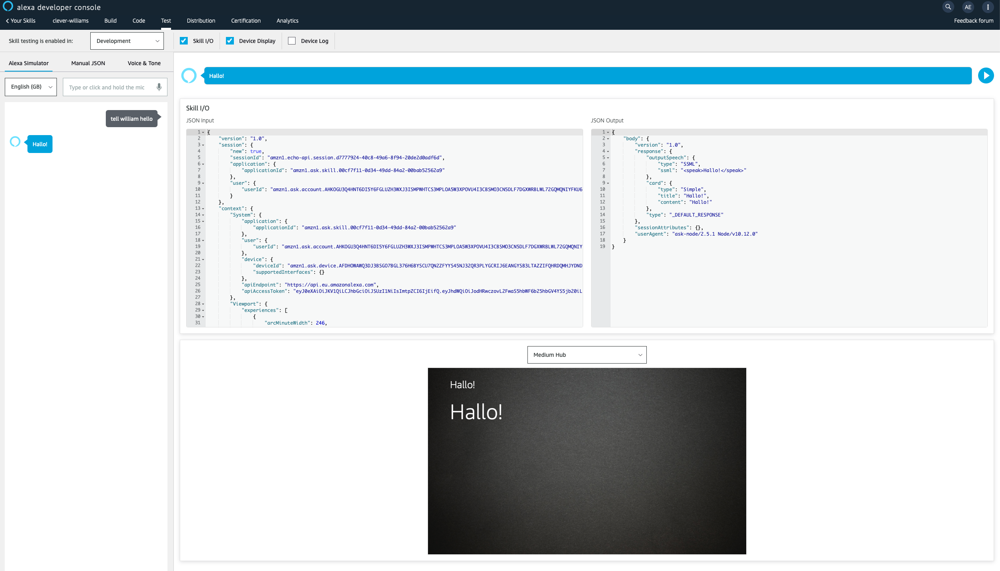

# alexa-sdk-nodejs-openfaas-example
Example of Alexa SDK with Node.js and OpenFaaS

## Example

William is a skill which is based upon the [Hello World](https://github.com/alexa/skill-sample-nodejs-hello-world) of the [Alexa SDK for Node.js](https://github.com/alexa/alexa-skills-kit-sdk-for-nodejs)

### Create your skill

* Create a Custom Skill
* Use a HTTPS URL with your OpenFaaS gateway URL and the function name:

```
https://my-openfaas.com/function/william-skill
```

If you don't want to setup your own TLS for your OpenFaaS server, or if it's behind a firewall then use the [ngrok to create a tunnel with HTTPS](https://ngrok.com).

### Setup your intent

Go to the JSON editor and paste in the following:

```json
{
    "interactionModel": {
        "languageModel": {
            "invocationName": "william",
            "intents": [
                {
                    "name": "AMAZON.FallbackIntent",
                    "samples": []
                },
                {
                    "name": "AMAZON.CancelIntent",
                    "samples": []
                },
                {
                    "name": "AMAZON.HelpIntent",
                    "samples": [
                        "what can I say"
                    ]
                },
                {
                    "name": "AMAZON.StopIntent",
                    "samples": []
                },
                {
                    "name": "AMAZON.NavigateHomeIntent",
                    "samples": []
                },
                {
                    "name": "HelloWorldIntent",
                    "slots": [],
                    "samples": [
                        "hi",
                        "hello there"
                    ]
                }
            ],
            "types": []
        }
    }
}
```

* Now click *Save Model*
* Finally click *Build Model*

### Deploy William

* Now edit william/stack.yml and replace "alexellis2" for your own Docker Hub username

* Pull the node10-express template:

```
faas-cli template store pull node10-express
```

* Deploy William via the `william-skill` function

```
faas-cli up
```

### Ask William a question

You can now ask William a question in the AWS Alexa console:

```
ask william hello
```

And here's the result!


## Extend the example

See if you can get William to say Hello in another language such as German: Hallo!



Now edit the `HelloWorldIntentHandler` in `william-skill/handler.js` and run `faas-cli up`

### Adapting the Skills SDK to the `node10-express` handler

Adapting the Skills SDK to the OpenFaaS `node10-express` template handler was simply a case of wrapping the handler. Your mileage may vary, and you may need to perform additional tweaks.

```js
module.exports = function(event, context) {

  const skillHandler = skillBuilder
  .addRequestHandlers(
    LaunchRequestHandler,
    HelloWorldIntentHandler,
    HelpIntentHandler,
    CancelAndStopIntentHandler,
    SessionEndedRequestHandler
  )
  .addErrorHandlers(ErrorHandler)
  .lambda();

  skillHandler(event.body, context, function(err, res) {
    console.log(err, res);

    context.status(200).succeed(res);
  });

}
```

For additional help please see the [Alexa SDK documentation](https://github.com/alexa/alexa-skills-kit-sdk-for-nodejs).
